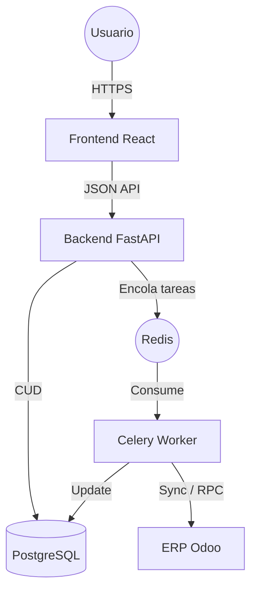

# Arquitectura Técnica - InvFlow

Este documento describe la estructura técnica y el stack tecnológico del sistema **InvFlow**, diseñado para la optimización de inventarios y la toma de decisiones basada en datos mediante la integración con Odoo.

## 1. Stack Tecnológico

El sistema utiliza una arquitectura moderna de microservicios contenida en Docker, dividida en tres capas principales:

### Frontend (Presentación)
- **Framework:** React 18 con TypeScript.
- **Build Tool:** Vite.
- **Estilos:** CSS3 Vanilla con diseño responsivo y moderno, optimizado para dashboards de alta densidad de datos.
- **Estado Global:** Hooks de React (`useState`, `useEffect`, `useCallback`).
- **Comunicación:** API Fetch para comunicación asíncrona con el backend.

### Backend (Lógica de Negocio)
- **Framework:** FastAPI (Python 3.10+).
- **Asincronía:** Implementación nativa de `async/await` para alta concurrencia.
- **ORM:** SQLModel (basado en SQLAlchemy y Pydantic) para la gestión de la base de datos.
- **Seguridad:** Autenticación mediante JWT (JSON Web Tokens) y hashing de contraseñas con Passlib (Bcrypt).
- **Tarea en Segundo Plano:** Celery con Redis como broker para la sincronización pesada con Odoo.

### Capa de Datos y Servicios
- **Base de Datos:** PostgreSQL para persistencia de productos, stocks historiados y configuraciones de usuario.
- **Caché/Broker:** Redis para la gestión de colas de tareas y estados de sincronización.
- **Conector ERP:** Integración mediante el protocolo JSON-RPC con instancias de Odoo.

## 2. Diagrama de Componentes

## 3. Estructura de Microservicios (Docker)

La aplicación se despliega mediante `docker-compose.yml`, orquestando los siguientes contenedores:

1. **db:** Base de Datos PostgreSQL expuesta internamente.
2. **redis:** Almacén de datos en memoria para el broker de tareas.
3. **backend:** Servicio FastAPI escuchando en el puerto 8000.
4. **worker:** Procesador de tareas asíncronas para la sincronización con Odoo.
5. **frontend:** Servidor de desarrollo Vite/React en el puerto 3000 (o 5173).

## 4. Modelo de Datos Principal

- **Product:** Almacena la definición del producto, incluyendo `odoo_id`, costes, precios y clasificaciones (ABC/XYZ).
- **StockQuant:** Representa la cantidad actual de un producto en un almacén específico.
- **StockMove:** Histórico de movimientos para cálculos de demanda diaria y desviación estándar.
- **User:** Gestión de accesos con roles (`admin`, `planner`, `viewer`).
- **Config:** Parámetros dinámicos de conexión a Odoo y constantes del sistema.

## 5. Seguridad y Roles

El sistema implementa un Control de Acceso Basado en Roles (RBAC):
- **admin:** Acceso total, incluyendo gestión de usuarios y configuración del sistema.
- **planner:** Acceso a inventarios, simulaciones y KPIs de rendimiento.
- **viewer:** Acceso de solo lectura a dashboards e informes.
