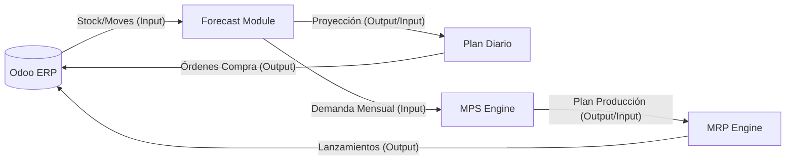
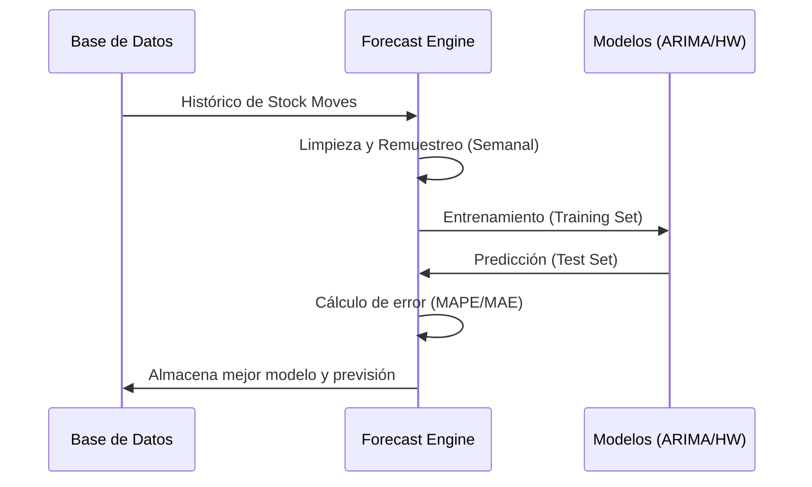
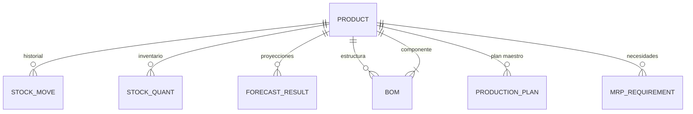

# MANUAL TÉCNICO DE ARQUITECTURA — INVFLOW ERP

## 1. INTRODUCCIÓN AL SISTEMA
InvFlow es un sistema avanzado de soporte a la decisión (DSS) y planificación de recursos (ERP/MRP) diseñado específicamente para la optimización de inventarios industriales. El sistema actúa como una capa de inteligencia analítica sobre Odoo ERP, permitiendo automatizar la previsión de demanda y la planificación de producción y materiales.

### Arquitectura General
El sistema sigue una arquitectura desacoplada **Frontend-Backend-Database** (N-Tier) con servicios modulares aislados.

Para un detalle exhaustivo de los cálculos, fórmulas y flujos de datos de cada módulo, consulte el documento: [Especificaciones de Módulos](./especificaciones_modulos.md).

## 2. FLUJO DE DATOS (INPUT/OUTPUT)
El sistema funciona como un pipeline de datos donde la salida de un módulo alimenta al siguiente.

---

## 2. STACK TECNOLÓGICO
- **Frontend**: React 18, TypeScript, Vite, Recharts, Lucide React, CSS Moderno (V4 Design System).
- **Backend**: Python 3.10+, FastAPI, SQLModel (ORM), PuLP (Optimización Lineal), Statsmodels (Forecasting).
- **Base de Datos**: PostgreSQL (Almacenamiento persistente de analíticas y planes).
- **Infraestructura**: Docker, Nginx Proxy.

---

## 3. SERVICIOS ANALÍTICOS (ENGINES)

### 3.1 Forecasting Engine
Encargado de la previsión de demanda. Implementa un pipeline de validación cruzada (Backtesting) para seleccionar el mejor modelo para cada SKU.

### 3.2 MPS Optimizer (Master Production Schedule)
Utiliza **Programación Lineal** para minimizar los costes totales de producción, almacenamiento y personal.
- **Solver**: COIN-OR (CBC) vía PuLP.
- **Variables**: Producción planificada, niveles de inventario, contrataciones y despidos.

### 3.3 MRP Engine (Material Requirements Planning)
Realiza la **Explosión de Materiales** multinivel utilizando las Listas de Materiales (BOM) y el Plan Maestro.
- **Lógica**: Desplazamiento por Lead Time y Cálculo de Necesidad Neta (NN = NB - Disp - Rec).

---

## 4. MODELO DE DATOS (ERD)
El sistema utiliza un esquema relacional optimizado para series temporales y jerarquías de productos.

---

## 5. INTEGRACIÓN ODOO
La comunicación se realiza mediante **XML-RPC** securizado.
1. **Autenticación**: Token-based / API Key.
2. **Sincronización**: Unidireccional (Odoo -> InvFlow) para datos maestros.
3. **Escritura**: Generación de Órdenes de Compra (PO) directamente en Odoo desde el módulo de inventario.

---

## 6. SEGURIDAD Y RENDIMIENTO
- **Autenticación**: JWT (JSON Web Tokens) con expiración configurable.
- **RBAC**: Control de acceso basado en roles (Admin, Planner, Viewer).
- **Optimización**: Cache de resultados analíticos pesados y optimización de consultas SQL para manejo de miles de SKU en tiempo real.
